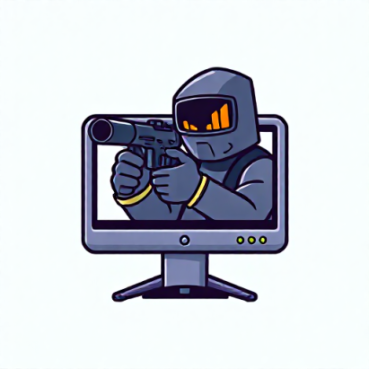

# Remote Screen Shooter


**Herramienta para tomar capturas de pantalla (screenshots) en el sistema donde se ejecute atravez de comandos de un bot de Discord.**

-**Comandos**: 
    -`!screenshot:` Toma una captura de pantalla y la envia.

**Setup**:
```batch
git clone https://github.com/Usr35/Remote-ScreenShooter.git
cd Remote-ScreenShooter
node index.js
```